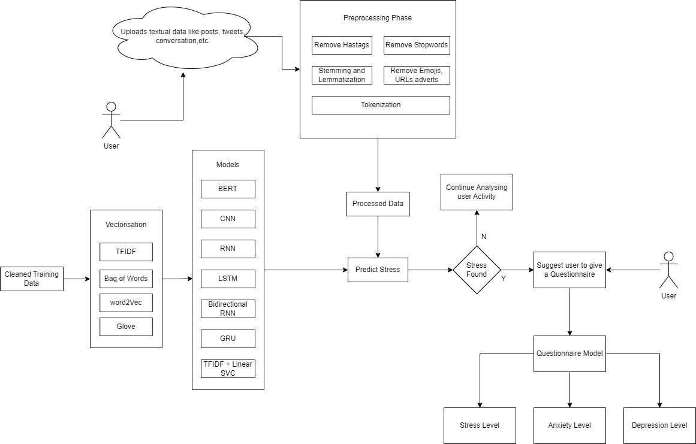

# Social Media Stress Detection

<!-- ALL-CONTRIBUTORS-BADGE:START - Do not remove or modify this section -->

<!-- ALL-CONTRIBUTORS-BADGE:END -->

## Abstract

In this study we explore an innovative method for stress detection and classification by utilizing a combination of machine learning and deep learning techniques. Today, social media can be a goldmine for user behavioural information. Users tend to be more open and outward on their social media posts and this can be used as a key feature in detecting stress. In this project we have studied and implemented various machine learning algorithms, deep neural networks, NLP techniques and pre-trained models like BERT for the detection of stress based on their social media posts and then classifying their stress levels based on their responses to the universally accepted DASS(Depression Anxiety Stress Scales) questionnaire.

## System Diagram

## Models Used

- BERT
- CNN
- RNN
- GRU
- TF-IDF
- LSTM

## Tech Stack 💻

- Python - Pandas, NLTK, Numpy, Tensorflow
- Flask and NextJS

## 2-Step Approach (Detection and Classification)

### Step - 1

- Perform various NLP techniques to clean, transform and pre-process the textual data.
- Perform vectorisation and tokenisation to represent data in a numerical format
- Finally, make training, testing and validation splits to choose model best fit for the choosen dataset

### Step - 2

- Once stress is identified, use the quessionairre model to classsify the severity of stress or anxiety or depression by answering the corresponding questions

## Collaborators ✨

<!-- ALL-CONTRIBUTORS-LIST:START - Do not remove or modify this section -->
<!-- prettier-ignore-start -->
<!-- markdownlint-disable -->
<table>
  <tbody>
    <tr>
      <td align="center" valign="top" width="14.28%"><a href="https://github.com/goldenPheonix02"> <b>Jai Patel</b></a> <a href="https://github.com/goldenPheonix02/social-media-stress-detection/commits?author=goldenPheonix02" title="Code">💻</a></td>
      <td align="center" valign="top" width="14.28%"><a href="https://github.com/kvm05"> <b>Kartik Menon</b></a> <a href="https://github.com/goldenPheonix02/social-media-stress-detection/commits?author=kvm05" title="Code">💻</a></td>
      <td align="center" valign="top" width="14.28%"><a href="https://github.com/parth0103"> <b>parth0103</b></a> <a href="https://github.com/goldenPheonix02/social-media-stress-detection/commits?author=parth0103" title="Code">💻</a></td>
    </tr>
  </tbody>
</table>

<!-- markdownlint-restore -->
<!-- prettier-ignore-end -->

<!-- ALL-CONTRIBUTORS-LIST:END -->
<!-- markdownlint-disable -->

<!-- markdownlint-restore -->
<!-- prettier-ignore-end -->

<!-- ALL-CONTRIBUTORS-LIST:END -->
